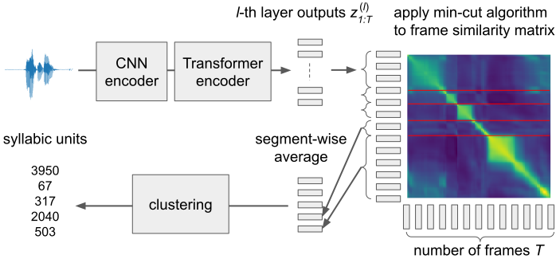
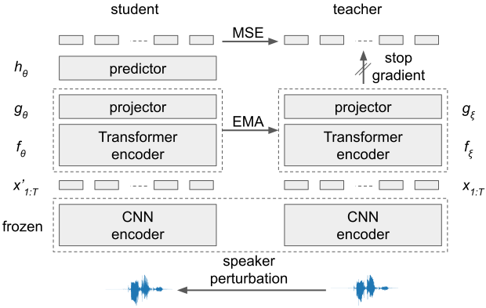

# Self-Supervised Syllable Discovery Based on Speaker-Disentangled HuBERT

[](https://opensource.org/licenses/MIT)
[](https://www.python.org)
[](https://colab.research.google.com/github/ryota-komatsu/speaker_disentangled_hubert/blob/main/demo.ipynb)

This is the official repository of the IEEE SLT 2024 paper [Self-Supervised Syllable Discovery Based on Speaker-Disentangled HuBERT](https://arxiv.org/)

## Setup

```shell
conda create -y -n py310 python=3.10.14 pip=24.0
conda activate py310
pip install -r requirements/requirements.txt

sh scripts/setup.sh
```

## Usage: encoding waveforms into pseudo-syllabic units



```python
import torchaudio

from src.speaker_disentangled_hubert import BYOLForSyllableDiscovery

wav_path = "/path/to/wav"

# download a pretrained model from hugging face hub
model = BYOLForSyllableDiscovery.from_hf_hub().cuda()

# load a waveform
waveform, sr = torchaudio.load(wav_path)
waveform = torchaudio.functional.resample(waveform, sr, 16000)

# encode a waveform into pseudo-syllabic units
outputs = model(waveform.cuda())

# pseudo-syllabic units
units = outputs["units"]  # [3950, 67, ..., 503]
```

## Demo

Google Colab demo is found [here](https://colab.research.google.com/github/ryota-komatsu/speaker_disentangled_hubert/blob/main/demo.ipynb).

## Models



Download models from the following links.
| Model                       | Link                                                                                                                    |
| --------------------------- | ----------------------------------------------------------------------------------------------------------------------- |
| Speaker-disentangled HuBERT | [download](https://huggingface.co/ryota-komatsu/speaker_disentangled_hubert/resolve/main/models/byol/checkpoint)        |
| KMeans                      | [download](https://huggingface.co/ryota-komatsu/speaker_disentangled_hubert/resolve/main/models/byol/quantizer1.joblib) |
| Agglomerative clustering    | [download](https://huggingface.co/ryota-komatsu/speaker_disentangled_hubert/resolve/main/models/byol/quantizer2.npy)    |

Other models can be downloaded from [Hugging Face](https://huggingface.co/ryota-komatsu/speaker_disentangled_hubert/tree/main).

## Data Preparation

If you already have LibriSpeech, you can use it by editing [a config file](configs/default.yaml#L14);
```yaml
dataset:
  root: "/path/to/LibriSpeech/root" # ${dataset.root}/LibriSpeech/train-clean-100, train-clean-360, ...
```

otherwise you can download the new one under `dataset_root`.
```shell
dataset_root=data  # be consistent with dataset.root in a config file

sh scripts/download_librispeech.sh ${dataset_root}
```

Check the directory structure
```
dataset.root in a config file
└── LibriSpeech/
    ├── train-clean-100/
    ├── train-clean-360/
    ├── train-other-500/
    ├── dev-clean/
    ├── dev-other/
    ├── test-clean/
    ├── test-other/
    └── SPEAKERS.TXT
```

## Training & Evaluation

```shell
python main.py --config configs/default.yaml
```

## Citation

```bibtex
@inproceedings{Komatsu_Self-Supervised_Syllable_Discovery_2024,
  author = {Komatsu, Ryota and Shinozaki, Takahiro},
  title = {Self-Supervised Syllable Discovery Based on Speaker-Disentangled HuBERT},
  year = {2024},
  month = {Dec.},
  booktitle = {IEEE Spoken Language Technology Workshop},
  pages = {},
}
```