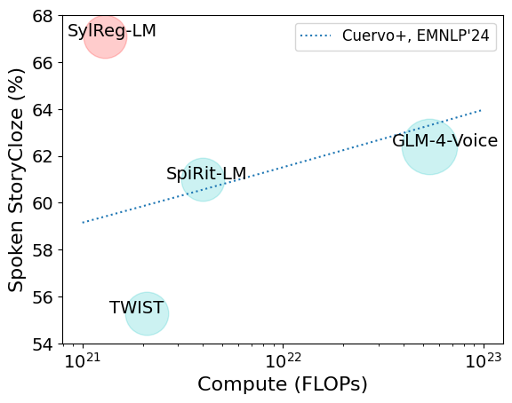
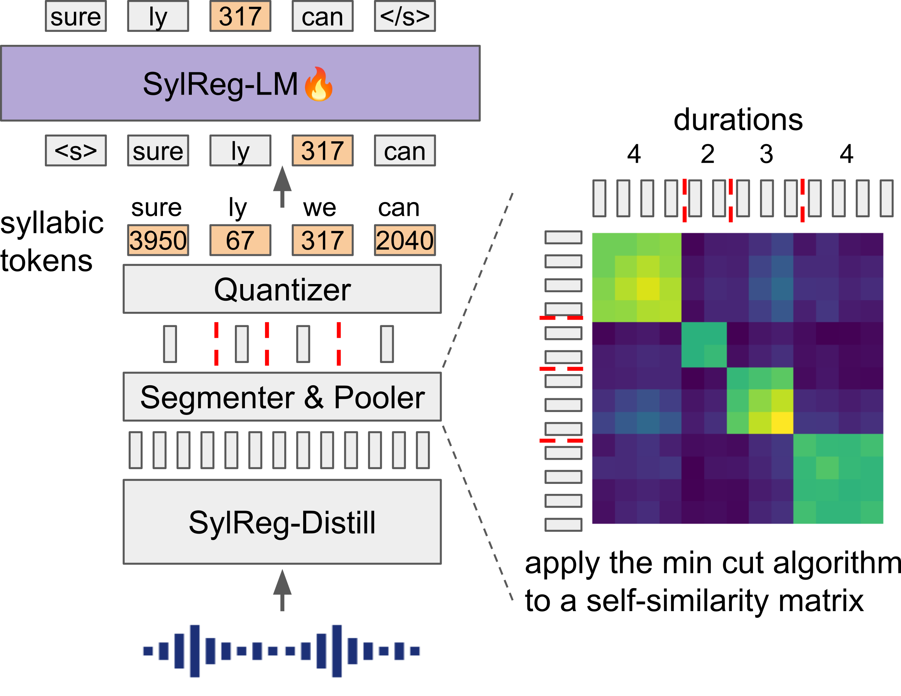

# SylReg: Speaker-Disentangled Chunk-Wise Regression for Syllabic Tokenization

[](https://opensource.org/licenses/MIT)
[](https://www.python.org)
[](https://colab.research.google.com/github/ryota-komatsu/speaker_disentangled_hubert/blob/main/demo.ipynb)
[](https://arxiv.org/abs/2409.10103)
[](https://huggingface.co/collections/ryota-komatsu/sylreg)
[](https://ryota-komatsu.github.io/speaker_disentangled_hubert)

This is the official repository of the IEEE SLT 2024 paper [Self-Supervised Syllable Discovery Based on Speaker-Disentangled HuBERT](https://arxiv.org/abs/2409.10103).

## Results



## Usage: Syllabic tokenization for speech language models



```python
import re

import torch
import torchaudio
from transformers import AutoModelForCausalLM, AutoTokenizer

from src.flow_matching import FlowMatchingWithBigVGan
from src.s5hubert import SylRegForSyllableDiscovery

wav_path = "/path/to/wav"

# download pretrained models from hugging face hub
encoder = SylRegForSyllableDiscovery.from_pretrained("ryota-komatsu/SylReg-Distill", device_map="cuda", dtype="auto")
decoder = FlowMatchingWithBigVGan.from_pretrained("ryota-komatsu/SylReg-Decoder", device_map="cuda", dtype="auto")
speechlm = AutoModelForCausalLM.from_pretrained("ryota-komatsu/SylReg-LM-7B-Instruct", device_map="cuda", dtype="auto")
tokenizer = AutoTokenizer.from_pretrained("ryota-komatsu/SylReg-LM-7B-Instruct")

# load a waveform
waveform, sr = torchaudio.load(wav_path)
waveform = torchaudio.functional.resample(waveform, sr, 16000)

# encode a waveform into syllabic units
outputs = encoder(waveform.to(encoder.device))
units = outputs[0]["units"]  # [3950, 67, ..., 503]

# speech language modeling
messages = [
    {"role": "user", "content": "".join(f"<{unit}>" for unit in units)},
]

input_ids = tokenizer.apply_chat_template(
    messages,
    tokenize=True,
    add_generation_prompt=True,
    return_tensors="pt",
).input_ids.to(speechlm.device)

generated_ids = speechlm.generate(input_ids=input_ids, do_sample=True, temperature=0.8)[0]

units = tokenizer.decode(generated_ids)
units = torch.tensor([int(unit) for unit in re.findall(r"<(\d+)>", units)], device=decoder.device)

# unit-to-speech synthesis
generated_speech = decoder(units.unsqueeze(0)).waveform.cpu()
```

## Demo

- Speech resynthesis examples can be heard on the [project page](https://ryota-komatsu.github.io/speaker_disentangled_hubert).
- Google Colab demo is found [here](https://colab.research.google.com/github/ryota-komatsu/speaker_disentangled_hubert/blob/main/demo.ipynb).
- Local gradio demo: `python app.py`

## Models

You can download a pretrained model from [Hugging Face](https://huggingface.co/collections/ryota-komatsu/sylreg).

## Setup

```shell
sudo apt install git-lfs  # for UTMOS

# fairseq does not support python 3.11+
# omegaconf 2.0.6 has a non-standard dependency specifier PyYAML>=5.1.*. pip 24.1 will enforce this behaviour change.
# pin to setuptools=81.0.0 See https://github.com/tensorflow/tensorboard/issues/7003
conda create -y -n py310 -c pytorch -c nvidia -c conda-forge python=3.10 pip=24.0 setuptools=81.0.0 faiss-gpu=1.13.2
conda activate py310
pip install -r requirements/requirements.txt

sh scripts/setup.sh
```

## Data Preparation

You can download datasets under `dataset_root`.
```shell
dataset_root=data  # be consistent with dataset.root in a config file

sh scripts/download_librispeech.sh ${dataset_root}
sh scripts/download_libritts.sh ${dataset_root}
sh scripts/download_librilight.sh ${dataset_root}  # 7TB
sh scripts/download_slm21.sh  # download sWUGGY and sBLIMP
sh scripts/download_tSC.sh
```

> [!TIP]
> If you already have LibriSpeech, you can use it by editing [a config file](configs/speech2unit/default.yaml#L13);
> ```yaml
> dataset:
>   root: "/path/to/LibriSpeech/root" # ${dataset.root}/LibriSpeech/train-clean-100, train-clean-360, ...
> ```

Check the directory structure
```
dataset.root in a config file
└── LibriSpeech/
    ├── train-clean-100/
    ├── train-clean-360/
    ├── train-other-500/
    ├── dev-clean/
    ├── dev-other/
    ├── test-clean/
    ├── test-other/
    └── SPEAKERS.TXT
```

## Syllable discovery

```shell
accelerate launch \
  --config_file=configs/speech2unit/ddp.yaml \
  --main_process_ip= \
  --machine_rank= \
  main_speech2unit.py train
```

To run only a sub-task (train, syllable_segmentation, quantize, or evaluate), specify it as an argument.

```shell
python main_speech2unit.py train --config configs/speech2unit/default.yaml
```

## Unit-to-speech synthesis

```shell
python main_unit2speech.py train_dit --config=configs/unit2speech/default.yaml
```

## Speech language modeling

```shell
GROUP_NAME=

qsub -g ${GROUP_NAME} scripts/run_speechlm_deepspeed.bash configs/speechlm/default.yaml
```

## Citation

```bibtex
@inproceedings{Komatsu_Self-Supervised_Syllable_Discovery_2024,
  author    = {Komatsu, Ryota and Shinozaki, Takahiro},
  title     = {Self-Supervised Syllable Discovery Based on Speaker-Disentangled {HuBERT}},
  year      = {2024},
  month     = {Dec.},
  booktitle = {IEEE Spoken Language Technology Workshop},
  pages     = {1131--1136},
  doi       = {10.1109/SLT61566.2024.10832325},
}
```

```bibtex
@article{Komatsu_SylReg_2026,
  author    = {Komatsu, Ryota and Kawakita, Kota and Okamoto, Takuma and Shinozaki, Takahiro},
  title     = {Speaker-Disentangled Chunk-Wise Regression for Syllabic Tokenization},
  year      = {2026},
  volume    = {},
  journal   = {},
  pages     = {},
}
```